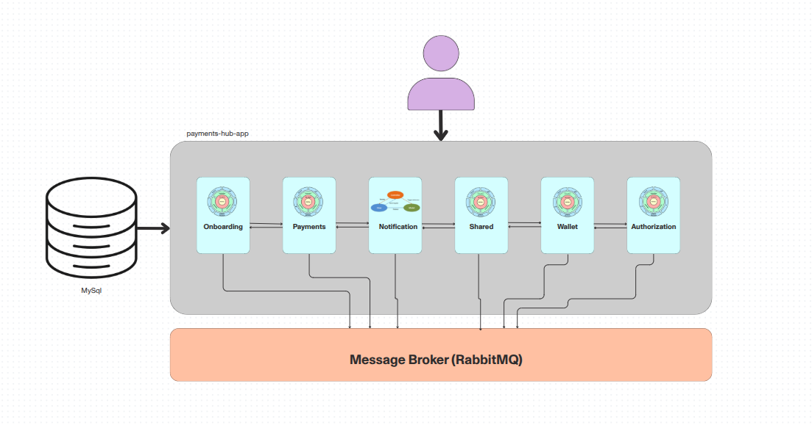

# API para Transferência Simplificada

Este projeto é uma **API monolítica modularizada** desenvolvida com **Hyperf (PHP)**, utilizando princípios de arquitetura limpa. Ela gerencia transferências bancárias entre usuários, integrando **RabbitMQ** para comunicação assíncrona entre módulos. Inclui:

- Consumidores de eventos
- Lógica de notificação via **Email** e **SMS**
- Sistema de logs local
- Abstrações de domínio para facilitar testes e manutenção

A persistência é feita em um banco de dados **MySQL**.



---

## Casos de Uso

A API oferece quatro endpoints principais:

1. **Criação de Usuário** (`POST /user`)
2. **Depósito em Carteira** (`POST /credit`)
3. **Transferência** (`POST /transfer`)
4. **Listagem de Transferências** (`GET /transfer`)

Você pode importar a collection Postman em `/artifacts` ou consultar a especificação OpenAPI no mesmo diretório. Também há diagramas de sequência para os casos de uso de transferência (`create_transfer`, `process_transfer` e `notification_consumer`). Para visualizar, use o plugin PlantUML no VSCode ou o [site oficial](https://www.plantuml.com/).

---

## Pré-requisitos

- Docker (com plugin docker-compose)
- Make (para automação de comandos)

---

## Instalação

```bash
make up                 # Sobe containers (app, MySQL, Redis, RabbitMQ, etc.)
make container          # Acessa os containers da app
make install            # Instala dependências via Composer
make migration:fresh    # Roda migrations do banco
make start              # Inicia a aplicação Hyperf
```


Outros comandos como execução de testes, coverage e etc, podem ser visualizados no arquivo Makefile na raiz do projeto

## Orientações
- Crie um usuário (POST /user). Cada usuário já recebe uma carteira com saldo inicial zero. Tipos: common ou merchant.
- Deposite na carteira (POST /credit), usando o ID do usuário retornado.
- Efetue a transferência (POST /transfer), informando o ID do pagador, o ID do recebedor e o valor.
- Verifique o status em (GET /transfer).

Para facilitar, importe a collection Postman em /artifacts.

## Próximos passos
### Funcionalidades
- Possibilidade de um usuário possuir mais de uma carteira para permitir transferência entre usuários
- Implantar mecanismo em banco NoSql ou outra tecnologia para armazenar o histórico de mudança do status da transferência de modo a permitir reconstruir a cadeia de eventos

### Melhorias
- Rever fluxo de mensageria - Notificações desnecessárias
- Adicionar mecanismos de análise estática em hooks do git
- Revisar containers
- Introduzir mecanismos de cache para consulta de saldo
- Implementar agentes de observabilidade
- Implementar serviço de gerenciamento de log (Seq, Logstach + Kibana)